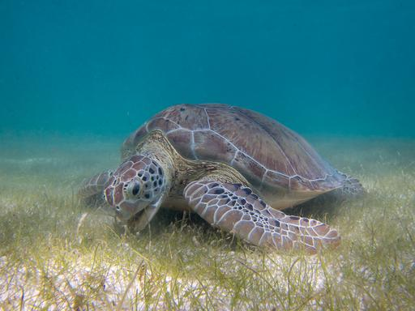
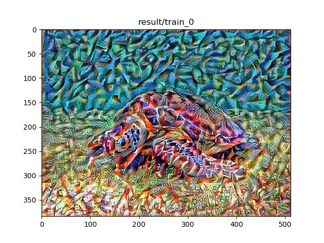

# Style transfer
## 参考
[Tensorflow 官方教程][1] 风格迁移  
Image style transfer using convolutional neural networks. CVPR 2016

## 基本原理
- 下图是论文给出的实现框架
- a是风格图，p是内容图，x是随机生成的噪声图。
该过程的总体思想就是通过对噪声图像进行约束，使其不断的同时趋近于内容图也趋近于风格图。这个约束怎么实现的呢？论文中使用的是两种（风格和内容）
损失来进行约束。
- 内容损失 content, 是由内容图和随机噪声图经过VGG19卷积
滤波后，在第四层分别的feature map的距离的平方和。
- 风格损失 style, 先对风格图和噪声图的每一层滤波
feature map分别求gram矩阵，再求其距离的平方和获得风格损失。
- 最后添加总变差损失，目的是为了使生成的图片更加平滑，防止出现  high frequency artifacts.
总变差类似于图像边缘soble算子，是两个方向的梯度. 

## 结果
输入的Content图   

输入的Style图 

输出的合成效果图:
- 迭代1个周期(100 step): 
- 迭代5个周期: 
- 迭代10个周期: 

[1]:[https://raw.githubusercontent.com/tensorflow/docs/master/site/en/r2/tutorials/generative/style_transfer.ipynb]

